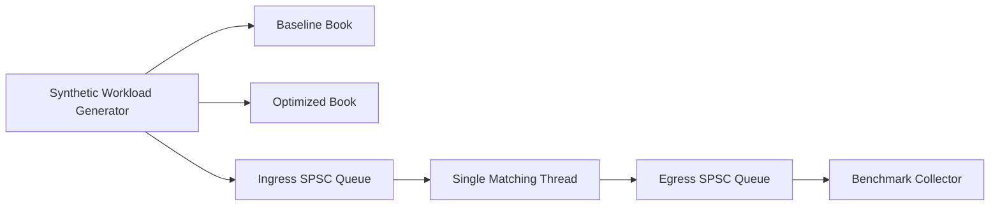

# Low-Latency Limit Order Book Simulator

Portfolio-grade C++20 matching engine project focused on quant-dev signal: deterministic price-time priority matching, cache-aware data structures, staged optimization, and reproducible Linux-style benchmarking.

## Plain-English Overview

An **order book** is the live list of buyers and sellers waiting to trade.

- A **bid** is a buy order.
- An **ask** is a sell order.
- A **limit order** says "buy up to this price" or "sell down to this price."
- A **market order** says "trade immediately at the best available prices."
- A **cancel** removes an order that is currently resting in the book.

The matching engine applies **price-time priority**:

- better price trades first
- if price ties, older orders trade first

An **order book simulator** is a program that imitates that process without being a real exchange. It lets you inspect how orders match, how the book changes, and how fast the engine runs.

## What This Project Is

This repo is both:

- a market microstructure project, because it models exchange-style matching logic
- a systems performance project, because it measures data structure choices, latency, throughput, and concurrency tradeoffs

The project builds and compares three versions of the same matching idea:

- **Baseline single-threaded engine**: simplest correct implementation
- **Optimized single-threaded engine**: better order lookup and lower hot-path overhead
- **Concurrent pipeline**: producer thread -> queue -> matcher thread -> queue -> consumer thread

The concurrent version does **not** make one order book match on multiple threads at once. It keeps one matching thread for determinism and moves transport around it into queues.

## What It Does

- Implements strict price-time priority for `LIMIT`, `MARKET`, and `CANCEL` orders.
- Supports `BUY`/`SELL`, partial fills, full fills, resting liquidity, cancel rejection, and best bid/ask snapshots.
- Compares three execution stages:
  - baseline single-threaded book
  - optimized single-threaded book
  - optimized concurrent pipeline with lock-free SPSC queues
- Generates deterministic synthetic workloads for:
  - balanced mixed flow
  - cancel-heavy flow
  - bursty traffic
- Replays normalized real-world event datasets from CSV when you have order-level market data locally

## Architecture



The project keeps matching single-threaded for correctness and determinism, then adds concurrency around the hot path instead of inside it. That gives a clean interview story: we optimize data layout first, then isolate ingestion/output with lock-free queues.

## Data Structure Evolution

### 1. Baseline
- `std::map<price, std::deque<order>>` for bids and asks
- linear search inside a price level on cancel
- intentionally simple for a credible "before optimization" benchmark

### 2. Optimized
- `std::map<price, std::list<order>>` with FIFO order queues per level
- O(1)-style order lookup by ID using iterators into resting levels
- reserved hash map capacity to reduce allocator churn on the hot path

### 3. Concurrent Pipeline
- lock-free SPSC ingress and egress rings
- one matching thread per book
- preserves deterministic matching while separating producer, matcher, and consumer responsibilities

## Project Layout

- `include/lob/types.hpp`: domain types and result models
- `include/lob/order_book.hpp`: engine interface, workload generation, and benchmarking API
- `src/engines/`: baseline and optimized matching engine implementations
- `src/benchmark.cpp`: benchmark runner and CSV artifact generation
- `src/replay.cpp`: replay export for the frontend dashboard
- `tests/test_order_books.cpp`: correctness and determinism tests
- `scripts/run_benchmarks.sh`: repeatable benchmark entrypoint
- `frontend/`: static dashboard for replaying order flow and book state

## Build

### CMake flow

```bash
cmake -S . -B build -DCMAKE_BUILD_TYPE=Release
cmake --build build --parallel
ctest --test-dir build --output-on-failure
```

### Direct clang++ fallback

```bash
mkdir -p build
clang++ -std=c++20 -O3 -pthread -Iinclude \
  src/engines/baseline_order_book.cpp \
  src/engines/optimized_order_book.cpp \
  src/workload.cpp \
  src/dataset.cpp \
  src/benchmark.cpp \
  src/main.cpp \
  -o build/lob_simulator

clang++ -std=c++20 -O2 -pthread -Iinclude \
  src/engines/baseline_order_book.cpp \
  src/engines/optimized_order_book.cpp \
  src/workload.cpp \
  src/dataset.cpp \
  src/benchmark.cpp \
  tests/test_order_books.cpp \
  -o build/lob_tests
```

## Usage

### Run tests

```bash
./build/lob_tests
```

### Benchmark one workload

```bash
./build/lob_simulator \
  --mode benchmark \
  --profile balanced \
  --orders 100000 \
  --seed 42 \
  --output results/balanced.csv
```

### Simulate and inspect order flow

```bash
./build/lob_simulator --mode simulate --profile balanced --orders 1000 --seed 42
```

### Replay a real dataset from CSV

```bash
./build/lob_simulator \
  --mode simulate \
  --dataset data/btc_usd_events.csv \
  --dataset-limit 50000
```

### Benchmark a real dataset

```bash
./build/lob_simulator \
  --mode benchmark \
  --dataset data/btc_usd_events.csv \
  --dataset-limit 50000 \
  --output results/btc_usd.csv
```

### Normalize a LOBSTER message file

```bash
python3 scripts/normalize_lobster.py \
  --input data/AAPL_2012-06-21_34200000_57600000_message_10.csv \
  --output data/aapl_lobster_normalized.csv \
  --limit 50000
```

Then run the simulator against the normalized file:

```bash
./build/lob_simulator \
  --mode benchmark \
  --dataset data/aapl_lobster_normalized.csv \
  --output results/aapl_lobster.csv
```

### Run the full benchmark sweep

```bash
bash scripts/run_benchmarks.sh
```

### Launch the frontend dashboard

First generate dashboard data:

```bash
./build/lob_simulator --mode export-dashboard --profile balanced --orders 100000 --seed 42 --output results/balanced.csv
./build/lob_simulator --mode export-dashboard --profile cancel_heavy --orders 100000 --seed 42 --output results/cancel_heavy.csv
./build/lob_simulator --mode export-dashboard --profile bursty --orders 100000 --seed 42 --output results/bursty.csv
```

Then serve the repo root and open the dashboard:

```bash
bash scripts/serve_frontend.sh
```

Visit [http://localhost:8000/frontend/index.html](http://localhost:8000/frontend/index.html)

## Dataset Format

The real-data path expects a normalized CSV with one order event per row. Required columns:

- `type`: `limit`, `market`, or `cancel`
- `side`: `buy` or `sell`
- `order_id`: stable order identifier

Optional columns:

- `timestamp`: integer event timestamp
- `sequence`: integer sequence number
- `price`: integer price in ticks
- `qty`: integer quantity

Example:

```csv
timestamp,sequence,type,side,order_id,price,qty
1710000001,1,limit,buy,10001,4312500,5
1710000002,2,limit,sell,10002,4312600,3
1710000003,3,market,buy,10003,0,2
1710000004,4,cancel,sell,10002,0,0
```

Notes:

- This loader is for order-event datasets, not top-of-book snapshots.
- If your source is exchange-specific, normalize it into this schema first.
- L2 snapshot/depth feeds do not contain enough information to replay strict price-time matching by themselves.
- `scripts/normalize_lobster.py` converts LOBSTER message files into this format.
- The normalizer keeps event types `1` add, `2` partial cancel, `3` delete, and `4` visible execution.
- It currently skips hidden executions (`5`) and unsupported rows like halts/cross trades, and it prints those counts so you know how much was dropped.

## Benchmark Methodology

- Fixed-seed synthetic workloads for reproducibility
- 100,000 events per profile in the current checked-in comparison
- Metrics:
  - throughput in orders/sec
  - p50/p95/p99 service time
  - p50/p95/p99 end-to-end latency
  - p50/p95/p99 queue delay
  - max queue depth for the concurrent pipeline
- Latency semantics:
  - **service time** = only time spent inside the matcher
  - **end-to-end latency** = total time from entering the system to leaving it
  - **queue delay** = end-to-end latency minus service time
  - for single-thread engines, end-to-end latency is the same as service time and queue delay is zero
- Dashboard semantics:
  - the browser replays exported JSON from the baseline and optimized engines step by step
  - the pipeline appears in the benchmark cards because it shares matching behavior with the optimized engine but has different transport/queueing latency

## Measured Results

All results below were generated from the current repo implementation with:

```bash
./build/lob_simulator --mode benchmark --profile <profile> --orders 100000 --seed 42 --output results/<profile>.csv
```

### Balanced workload

| Engine | Throughput (ops/s) | Service p50 (ns) | E2E p50 (ns) | Queue p50 (ns) | Max queue depth |
| --- | ---: | ---: | ---: | ---: | ---: |
| Baseline | 6.39M | 125 | 125 | 0 | 0 |
| Optimized | 9.82M | 42 | 42 | 0 | 0 |
| Concurrent pipeline | see generated CSV | comparable to optimized service time | higher when queue backs up | visible directly | workload-dependent |

### Cancel-heavy workload

| Engine | Throughput (ops/s) | Service p50 (ns) | E2E p50 (ns) | Queue p50 (ns) | Max queue depth |
| --- | ---: | ---: | ---: | ---: | ---: |
| Baseline | 9.61M | 83 | 83 | 0 | 0 |
| Optimized | 13.55M | 42 | 42 | 0 | 0 |
| Concurrent pipeline | see generated CSV | comparable to optimized service time | higher when queue backs up | visible directly | workload-dependent |

### Bursty workload

| Engine | Throughput (ops/s) | Service p50 (ns) | E2E p50 (ns) | Queue p50 (ns) | Max queue depth |
| --- | ---: | ---: | ---: | ---: | ---: |
| Baseline | 8.36M | 83 | 83 | 0 | 0 |
| Optimized | 11.53M | 42 | 42 | 0 | 0 |
| Concurrent pipeline | see generated CSV | comparable to optimized service time | higher when queue backs up | visible directly | workload-dependent |

## What Improved And Why

- The optimized single-thread book is consistently faster than baseline because cancels no longer scan a full price level and hot-path data is more compact.
- The optimized engine should show lower **service time** than baseline because the matcher itself is doing less work on cancels and book updates.
- The pipeline lets us separate **matcher work** from **waiting time**. If pipeline service time stays close to optimized single-thread service time, the matcher is healthy.
- If pipeline end-to-end latency grows far above service time, that does **not** mean matching got slower. It means queueing delay grew because orders were waiting to be processed.

That distinction is the whole point of the updated benchmark. It turns "concurrency looks slow" into a clearer statement:

- the matching core may still be fast
- the pipeline may still preserve throughput
- but the system is saturating, so queueing dominates end-to-end latency

## Profiling Workflow

On Linux, use `perf` on the release binary:

```bash
perf stat ./build/lob_simulator --mode benchmark --profile balanced --orders 500000 --output results/perf_balanced.csv
perf record -g ./build/lob_simulator --mode benchmark --profile bursty --orders 500000 --output results/perf_bursty.csv
perf report
```

If Brendan Gregg's FlameGraph tools are installed:

```bash
perf script > perf.out
stackcollapse-perf.pl perf.out > perf.folded
flamegraph.pl perf.folded > flamegraph.svg
```

## Test Coverage

- price-time priority across same-price resting orders
- partial fill and full fill behavior
- market order execution against resting liquidity
- cancel success and missing-order rejection
- top-of-book updates after fills and cancels
- deterministic end state comparison between direct optimized processing and concurrent pipeline processing

## Glossary

- **Aggressive order**: the incoming order that tries to trade immediately against resting liquidity.
- **Allocator churn**: overhead from frequent memory allocation/deallocation on the hot path.
- **Book state**: the current bids, asks, and quantities after processing a sequence of events.
- **Burst traffic**: a workload where many events arrive in a short interval instead of evenly spaced.
- **Cache-aware**: designed to reduce slow memory access and make CPU caches more effective.
- **Deterministic**: same input sequence, same output sequence every run.
- **Egress**: the path out of a system after processing is complete.
- **Hot path**: the part of the code executed most often and most performance-sensitive.
- **Ingress**: the path into a system before processing begins.
- **Latency percentile**: a summary of how slow the tail is; for example, p99 means 99% of operations are faster than that value.
- **Lock-free**: uses atomic coordination instead of mutex locking for progress between threads.
- **Matching engine**: the component that processes orders and decides whether they trade or rest.
- **Microstructure**: the detailed mechanics of how markets accept, prioritize, and match orders.
- **Order ID lookup**: direct access to a resting order by its identifier, useful for cancels.
- **Queue depth**: how many items are waiting in a queue.
- **Replay**: running a saved event sequence through the engine again for inspection or measurement.
- **Saturation**: the point where arrival rate exceeds processing capacity and queues start growing.
- **Synthetic workload**: generated test data rather than live or historical market data.
- **Throughput**: number of events processed per second.

## Next Extensions

- multi-symbol sharding across books
- market data replay from historical feeds
- object pool / arena-backed order allocation
- richer latency reporting split into service time vs queueing time
- Linux-native profiling screenshots and flame graphs checked into `docs/`
- WebSocket-backed live streaming from the C++ engine instead of offline replay JSON
