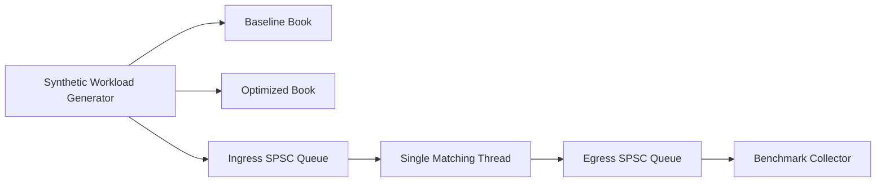

# Low-Latency Limit Order Book Simulator

Portfolio-grade C++20 matching engine project focused on quant-dev signal: deterministic price-time priority matching, cache-aware data structures, staged optimization, and reproducible Linux-style benchmarking.

## What It Does

- Implements strict price-time priority for `LIMIT`, `MARKET`, and `CANCEL` orders.
- Supports `BUY`/`SELL`, partial fills, full fills, resting liquidity, cancel rejection, and best bid/ask snapshots.
- Compares three execution stages:
  - baseline single-threaded book
  - optimized single-threaded book
  - optimized concurrent pipeline with lock-free SPSC queues
- Generates deterministic synthetic workloads for:
  - balanced mixed flow
  - cancel-heavy flow
  - bursty traffic

## Architecture



The project keeps matching single-threaded for correctness and determinism, then adds concurrency around the hot path instead of inside it. That gives a clean interview story: we optimize data layout first, then isolate ingestion/output with lock-free queues.

## Data Structure Evolution

### 1. Baseline
- `std::map<price, std::deque<order>>` for bids and asks
- linear search inside a price level on cancel
- intentionally simple for a credible "before optimization" benchmark

### 2. Optimized
- `std::map<price, std::list<order>>` with FIFO order queues per level
- O(1)-style order lookup by ID using iterators into resting levels
- reserved hash map capacity to reduce allocator churn on the hot path

### 3. Concurrent Pipeline
- lock-free SPSC ingress and egress rings
- one matching thread per book
- preserves deterministic matching while separating producer, matcher, and consumer responsibilities

## Project Layout

- `include/lob/types.hpp`: domain types and result models
- `include/lob/order_book.hpp`: engine interface, workload generation, and benchmarking API
- `src/engines/`: baseline and optimized matching engine implementations
- `src/benchmark.cpp`: benchmark runner and CSV artifact generation
- `tests/test_order_books.cpp`: correctness and determinism tests
- `scripts/run_benchmarks.sh`: repeatable benchmark entrypoint

## Build

### CMake flow

```bash
cmake -S . -B build -DCMAKE_BUILD_TYPE=Release
cmake --build build --parallel
ctest --test-dir build --output-on-failure
```

### Direct clang++ fallback

```bash
mkdir -p build
clang++ -std=c++20 -O3 -pthread -Iinclude \
  src/engines/baseline_order_book.cpp \
  src/engines/optimized_order_book.cpp \
  src/workload.cpp \
  src/benchmark.cpp \
  src/main.cpp \
  -o build/lob_simulator

clang++ -std=c++20 -O2 -pthread -Iinclude \
  src/engines/baseline_order_book.cpp \
  src/engines/optimized_order_book.cpp \
  src/workload.cpp \
  src/benchmark.cpp \
  tests/test_order_books.cpp \
  -o build/lob_tests
```

## Usage

### Run tests

```bash
./build/lob_tests
```

### Benchmark one workload

```bash
./build/lob_simulator \
  --mode benchmark \
  --profile balanced \
  --orders 100000 \
  --seed 42 \
  --output results/balanced.csv
```

### Simulate and inspect order flow

```bash
./build/lob_simulator --mode simulate --profile balanced --orders 1000 --seed 42
```

### Run the full benchmark sweep

```bash
bash scripts/run_benchmarks.sh
```

## Benchmark Methodology

- Fixed-seed synthetic workloads for reproducibility
- 100,000 events per profile in the current checked-in comparison
- Metrics:
  - throughput in orders/sec
  - p50/p95/p99 latency
  - max queue depth for the concurrent pipeline
- Latency semantics:
  - single-thread stages measure per-event processing latency
  - concurrent pipeline measures end-to-end latency from enqueue to egress, so queueing pressure is visible

## Measured Results

All results below were generated from the current repo implementation with:

```bash
./build/lob_simulator --mode benchmark --profile <profile> --orders 100000 --seed 42 --output results/<profile>.csv
```

### Balanced workload

| Engine | Throughput (ops/s) | p50 (ns) | p95 (ns) | p99 (ns) | Max queue depth |
| --- | ---: | ---: | ---: | ---: | ---: |
| Baseline | 6.39M | 125 | 292 | 458 | 0 |
| Optimized | 9.82M | 42 | 208 | 291 | 0 |
| Concurrent pipeline | 7.83M | 5,566,750 | 7,437,292 | 7,536,542 | 65,536 |

### Cancel-heavy workload

| Engine | Throughput (ops/s) | p50 (ns) | p95 (ns) | p99 (ns) | Max queue depth |
| --- | ---: | ---: | ---: | ---: | ---: |
| Baseline | 9.61M | 83 | 167 | 333 | 0 |
| Optimized | 13.55M | 42 | 125 | 209 | 0 |
| Concurrent pipeline | 10.75M | 2,724,375 | 3,566,333 | 3,746,333 | 51,614 |

### Bursty workload

| Engine | Throughput (ops/s) | p50 (ns) | p95 (ns) | p99 (ns) | Max queue depth |
| --- | ---: | ---: | ---: | ---: | ---: |
| Baseline | 8.36M | 83 | 250 | 334 | 0 |
| Optimized | 11.53M | 42 | 167 | 250 | 0 |
| Concurrent pipeline | 9.40M | 3,776,208 | 6,397,709 | 6,448,250 | 65,536 |

## What Improved And Why

- The optimized single-thread book is consistently faster than baseline because cancels no longer scan a full price level and hot-path data is more compact.
- In the balanced profile, the optimized engine improves throughput by about 53.5% over baseline.
- In the cancel-heavy profile, the optimized engine improves throughput by about 41.0% over baseline, which validates the direct-ID cancel path.
- In the bursty profile, the optimized engine improves throughput by about 37.8% over baseline.
- The concurrent pipeline still beats the baseline in throughput, but the checked-in run shows a clear systems tradeoff: once ingress outruns the single matching thread, queueing delay dominates end-to-end latency.

That last point is useful interview material rather than a weakness to hide. It shows the project measures real tradeoffs instead of assuming concurrency is automatically better.

## Profiling Workflow

On Linux, use `perf` on the release binary:

```bash
perf stat ./build/lob_simulator --mode benchmark --profile balanced --orders 500000 --output results/perf_balanced.csv
perf record -g ./build/lob_simulator --mode benchmark --profile bursty --orders 500000 --output results/perf_bursty.csv
perf report
```

If Brendan Gregg's FlameGraph tools are installed:

```bash
perf script > perf.out
stackcollapse-perf.pl perf.out > perf.folded
flamegraph.pl perf.folded > flamegraph.svg
```

## Test Coverage

- price-time priority across same-price resting orders
- partial fill and full fill behavior
- market order execution against resting liquidity
- cancel success and missing-order rejection
- top-of-book updates after fills and cancels
- deterministic end state comparison between direct optimized processing and concurrent pipeline processing

## Next Extensions

- multi-symbol sharding across books
- market data replay from historical feeds
- object pool / arena-backed order allocation
- richer latency reporting split into service time vs queueing time
- Linux-native profiling screenshots and flame graphs checked into `docs/`
